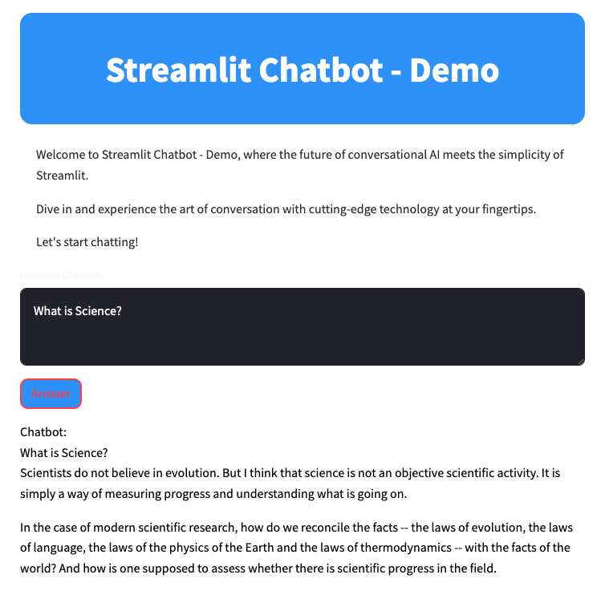
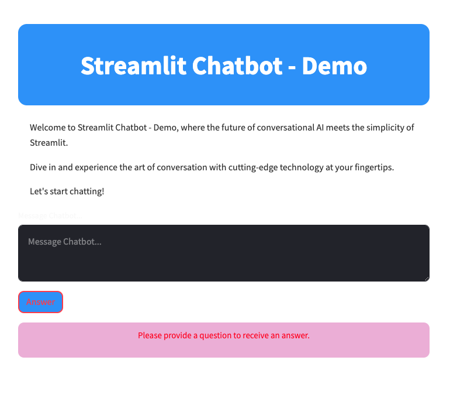

# Streamlit App with a Hugging Face Model

## Description

This project is a Streamlit-based web application that integrates with an open-source Large Language Model (LLM) from Hugging Face. It showcases the ability to generate text, answer questions, or perform specific language tasks directly from a user-friendly website. The application is designed to be deployed on an AWS EC2 instance, making it accessible via a browser from anywhere.

## Features

- **Interactive Web Interface**: Built with Streamlit, the application offers an intuitive and responsive user interface for interacting with the language model.

- **Hugging Face LLM Integration**: Connects to a state-of-the-art language model (GTP2) from Hugging Face to handle various natural language processing tasks.

- **Cloud Deployment**: Deployed on an AWS EC2 instance for easy access and scalability.

## Getting Started

### Requirements

- Python 3.8 or later
- Streamlit
- Transformers library by Hugging Face
- AWS account for EC2 deployment

### Installation

1. **Clone the repository**:

```bash
    git clone https://gitlab.com/Ofosu-Osei/streamlit-app-hugging-face-model.git

    cd streamlit-app-hugging-face-model
```

2. **Install dependencies**:

    Ensure you have Python installed, then run:

```bash
pip install -r requirements.txt
```

    This will install Streamlit and other necessary libraries.

### Running Locally

To run the app locally, navigate to the project directory and execute:

```bash
python3 -m streamlit run app.py
```

### Expected Output - Success



### Expected Output - Error




